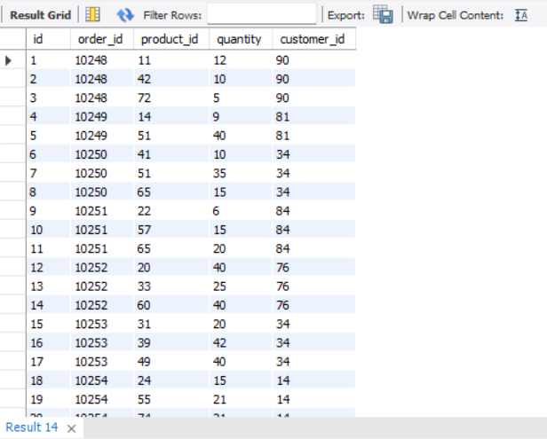
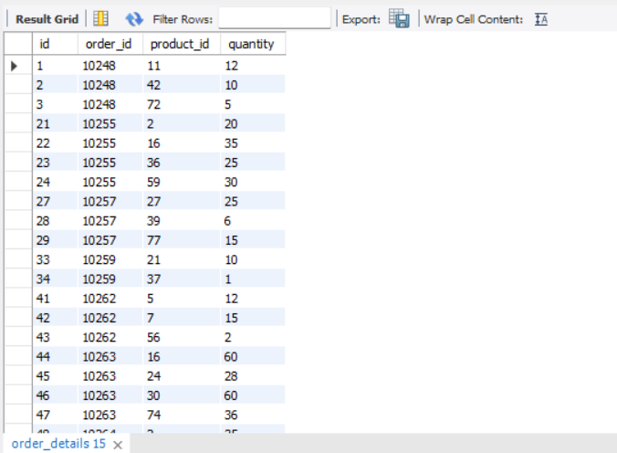
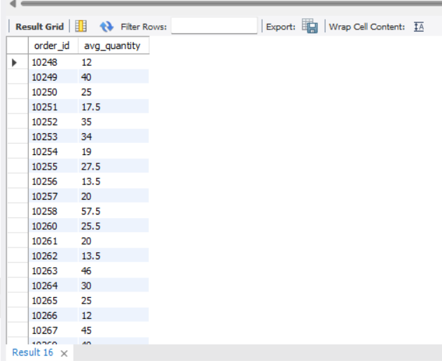
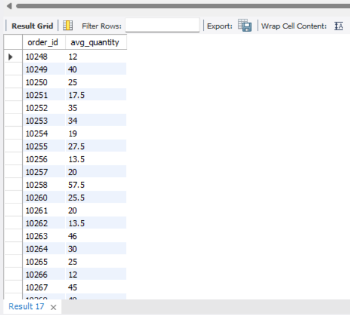
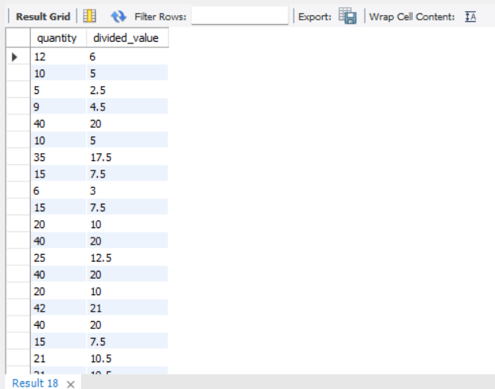

# goit-rdb-hw-05

## Homework overview

This repository contains SQL queries, execution results, and screenshots for homework assignment 05.

## Repository structure

* `queries.sql` — SQL queries for tasks 1–5
* `images/` — screenshots of executed queries and results
* `README.md` — short description of the work

---

## Task 1

Display the `order_details` table and the `customer_id` field from the `orders` table for each corresponding row from `order_details` using a nested query in the `SELECT` statement.

### SQL code

```sql
-- Task 1
SELECT
    od.*,
    (
        SELECT o.customer_id
        FROM orders AS o
        WHERE o.id = od.order_id
    ) AS customer_id
FROM order_details AS od;
```

### Alternative solution

```sql
SELECT
    od.*,
    o.customer_id
FROM order_details AS od
JOIN orders AS o
    ON o.id = od.order_id;
```

### Screenshot



---

## Task 2

Display the `order_details` table and filter the results so that the related record from the `orders` table satisfies the condition `shipper_id = 3` using a nested query in the `WHERE` statement.

### SQL code

```sql
-- Task 2
SELECT
    od.*
FROM order_details AS od
WHERE od.order_id IN (
    SELECT o.id
    FROM orders AS o
    WHERE o.shipper_id = 3
);
```

### Alternative solution

```sql
SELECT
    od.*
FROM order_details AS od
JOIN orders AS o
    ON o.id = od.order_id
    AND o.shipper_id = 3;
```

### Screenshot



---

## Task 3

Use a nested query in the `FROM` statement to select rows from `order_details` where `quantity > 10`. For the resulting data, find the average value of the `quantity` field grouped by `order_id`.

### SQL code

```sql
-- Task 3
SELECT
    temp.order_id,
    AVG(temp.quantity) AS avg_quantity
FROM (
    SELECT
        od.order_id,
        od.quantity
    FROM order_details AS od
    WHERE od.quantity > 10
) AS temp
GROUP BY temp.order_id;
```

### Alternative solution

```sql
SELECT
    od.order_id,
    AVG(od.quantity) AS avg_quantity
FROM order_details AS od
WHERE od.quantity > 10
GROUP BY od.order_id;
```

### Screenshot



---

## Task 4

Solve task 3 using the `WITH` operator to create a temporary table `temp`.

### SQL code

```sql
-- Task 4
WITH temp AS (
    SELECT
        od.order_id,
        od.quantity
    FROM order_details AS od
    WHERE od.quantity > 10
)
SELECT
    temp.order_id,
    AVG(temp.quantity) AS avg_quantity
FROM temp
GROUP BY temp.order_id;
```

### Screenshot



---

## Task 5

Create a function with two parameters that divides the first parameter by the second. Both parameters and the returned value must have the `FLOAT` type. Apply the function to the `quantity` attribute of the `order_details` table.

### SQL code

```sql
-- Task 5
DROP FUNCTION IF EXISTS divide;

DELIMITER //

CREATE FUNCTION divide(numerator FLOAT, denominator FLOAT)
RETURNS FLOAT
DETERMINISTIC
BEGIN
    IF denominator = 0 THEN
        RETURN NULL;
    END IF;
    RETURN numerator / denominator;
END//

DELIMITER ;

SELECT
    quantity,
    divide(quantity, 2) AS divided_value
FROM order_details;
```

### Screenshot


